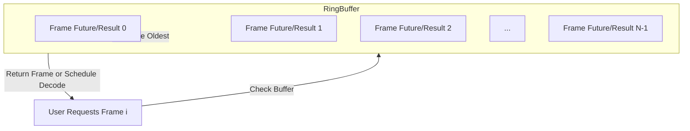

# ADR 0011: Ring Buffer Frame Cache for Sequential Access

## Status
Proposed

## Context
The current frame cache in alphastream-rs uses a thread-safe LRU (Least Recently Used) cache with prefetching and eviction strategies ([0003-frame-cache-policy.md](0003-frame-cache-policy.md)). While effective for mixed access patterns, this approach introduces complexity and overhead, especially when access is strictly sequential. The LRU policy and separate prefetching logic can be simplified for the dominant use case: streaming frames in order.

### Shortcomings of the Current LRU Cache
- Difficulty scheduling which frames should be prefetched, leading to suboptimal cache utilization and unpredictable performance.
- Inefficiency and apparent delays on the `get_frame` API, which may be due to implementation issues but are exacerbated by the LRU design.

## Decision
- Replace the LRU cache and prefetching scheme with a fixed-size ring buffer.
- The ring buffer holds upcoming frames, always filling from the requested frame onward.
- The buffer stores both task futures (for in-progress frame decoding) and optional results (for completed frames), using a unified data structure.
- Sequential access is assumed: when a frame is requested, the buffer is filled with the next N frames, overwriting the oldest as needed.
- Thread safety is maintained via `Arc<RwLock<...>>` or similar, as in the current implementation.
- The ring buffer is sized to balance memory usage and prefetch depth, with a recommended default (e.g., 512 frames).
- No explicit LRU eviction: the oldest frame is simply overwritten as the buffer advances.
- Operations from the previous cache implementation that are not essential—such as removing a single element or LRU eviction—are no longer required and should be omitted from the ring buffer cache design.

### Play Head and Seek Semantics
- The last requested frame is regarded as the "play head".
- Any move of the play head backwards, or any move forwards greater than the buffer size, is treated as a seek event, causing the whole cache to be invalidated.

### Scheduler Responsibilities
- The scheduler is responsible for filling the cache starting from the play head.
- The scheduler must stop or pause filling when the cache capacity is reached (i.e., when the ring buffer wraps around to just before the current play head).
- The scheduler must fill the cache as quickly as possible, using parallel and non-blocking operations.

## Consequences
- Greatly simplified cache logic and prefetching: no need for LRU tracking or separate prefetch scheduler.
- Improved performance for sequential workloads due to reduced locking and predictable memory access.
- Unified handling of in-progress and completed frames, reducing code complexity.
- Slightly less optimal for random access, but this is not a primary use case.
- Thread safety and predictable memory usage are preserved.

## Superseded ADRs
This ADR supersedes the following prior ADRs regarding frame cache and prefetching policy:
- [0003-frame-cache-policy.md](0003-frame-cache-policy.md)

## Architecture Diagram

## References
- [0003-frame-cache-policy.md](0003-frame-cache-policy.md)
- [../tasks/09-frame-cache-policy.md](../tasks/09-frame-cache-policy.md)
- [../tasks/24-lru-cache.md](../tasks/24-lru-cache.md)
- [../tasks/25-prefetching.md](../tasks/25-prefetching.md)
- [../tasks/26-thread-safety-cache.md](../tasks/26-thread-safety-cache.md)
- [../tasks/27-cache-scheduler-integration.md](../tasks/27-cache-scheduler-integration.md)
- [../RUST_IMPLEMENTATION.md](../RUST_IMPLEMENTATION.md)
- [../prd/prd-alphastream-rs.md](../prd/prd-alphastream-rs.md)
