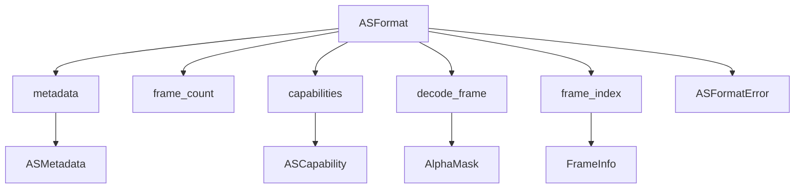

# Task 02 — Format Abstraction

## Objective
Define a unified trait abstraction for AlphaStream file formats (ASVR encrypted, ASVP plaintext, and future versions) in Rust, supporting metadata, frame discovery, per-frame decode, versioning, extensibility, and high performance.

---

## 1. ASFormat Trait Specification

The `ASFormat` trait provides a unified interface for all supported AlphaStream formats. It enables:
- Metadata access (dimensions, version, frame count)
- Frame discovery and random access
- Per-frame decode to alpha mask
- Capability negotiation for version/features
- Extensible error taxonomy
- Zero-copy and SIMD-friendly decode paths

### Trait Signature (Rust)

```rust
pub trait ASFormat {
    /// Returns format metadata (dimensions, version, etc)
    fn metadata(&self) -> &ASMetadata;

    /// Returns the total number of frames in the stream
    fn frame_count(&self) -> usize;

    /// Returns a list of supported capabilities for this format instance
    fn capabilities(&self) -> &[ASCapability];

    /// Decodes a single frame to an alpha mask (zero-copy if possible)
    /// Returns a borrowed or owned buffer, depending on implementation
    fn decode_frame(&self, frame_index: usize) -> Result<AlphaMask, ASFormatError>;

    /// Discovers frame offsets and sizes (for random access)
    fn frame_index(&self) -> &[FrameInfo];
}
```

#### Associated Types
- `ASMetadata`: struct with width, height, version, etc.
- `ASCapability`: enum of supported features (encryption, compression, etc).
- `AlphaMask`: decoded alpha mask (buffer, dimensions, stride).
- `FrameInfo`: struct with offset, length, keying info per frame.
- `ASFormatError`: error taxonomy (see below).

---

## 2. Versioning & Capability Negotiation

- **Supported formats:**
  - ASVR (encrypted, up to v1.5.0)
  - ASVP (plaintext, see [docs/FILE_FORMAT_PLAINTEXT.md](../FILE_FORMAT_PLAINTEXT.md))
  - Future versions: trait is extensible; new capabilities are feature-flagged via `ASCapability`.
- **Negotiation:**
  - On open, implementation inspects magic/version and selects the correct decoder.
  - Capabilities are exposed via `capabilities()` for runtime feature checks.
- **Salt/versioning:**
  - See [docs/FILE_FORMAT.md](../FILE_FORMAT.md#versioning-and-salts) for key derivation and version-specific handling.

---

## 3. Error Handling & Taxonomy

All trait methods return `Result<T, ASFormatError>`. The error enum covers:

```rust
enum ASFormatError {
    Io(std::io::Error),
    Format(String),        // Malformed or unsupported format
    Decode(String),        // Decompression or crypto failure
    VersionMismatch,       // Version/capability not supported
    OutOfBounds,           // Frame index out of range
    NotReady,              // Data not yet available (async)
    Timeout,               // Operation timed out
}
```

- Errors are non-panicking and diagnosable.
- Per-instance last error is maintained for diagnostics (see [docs/RUST_IMPLEMENTATION.md](../RUST_IMPLEMENTATION.md#error-handling-strategy)).
- See [docs/FILE_FORMAT.md](../FILE_FORMAT.md#error-handling) and [docs/FILE_FORMAT_PLAINTEXT.md](../FILE_FORMAT_PLAINTEXT.md#error-handling-and-validation) for format-specific error cases.

---

## 4. Memory Layout & SIMD/Zero-Copy Considerations

- **Frame decode:**
  - Decoded alpha masks are returned as tightly packed, row-major R8 buffers (see [docs/RUST_IMPLEMENTATION.md](../RUST_IMPLEMENTATION.md#frame-pixel-format--gpu-upload)).
  - Implementations must avoid unnecessary copies; prefer memory-mapped or borrowed slices when possible.
  - SIMD-friendly decode: inner loops for decompression and polyline expansion should be branch-minimized and vectorizable.
- **Alignment:**
  - All fields are little-endian, no padding in on-disk format (see [docs/FILE_FORMAT.md](../FILE_FORMAT.md#endianness-and-alignment)).
- **Resize:**
  - Nearest-neighbor scaling for output bitmaps (see [docs/RUST_IMPLEMENTATION.md](../RUST_IMPLEMENTATION.md#resize-policy)).

---

## 5. Summary Table: ASFormat Trait Responsibilities

| Responsibility         | Method(s)              | Notes/References                                                                 |
|-----------------------|------------------------|----------------------------------------------------------------------------------|
| Metadata              | `metadata()`           | [docs/FILE_FORMAT.md](../FILE_FORMAT.md), [docs/RUST_IMPLEMENTATION.md](../RUST_IMPLEMENTATION.md) |
| Frame count           | `frame_count()`        | [docs/FILE_FORMAT.md](../FILE_FORMAT.md#file-layout-overview)                    |
| Capability discovery  | `capabilities()`       | [docs/FILE_FORMAT.md](../FILE_FORMAT.md#versioning-and-salts)                    |
| Frame decode          | `decode_frame()`       | [docs/FILE_FORMAT.md](../FILE_FORMAT.md#drawing-model), [docs/REVERSE_ENGINEERING.md](../REVERSE_ENGINEERING.md) |
| Frame index/offsets   | `frame_index()`        | [docs/FILE_FORMAT.md](../FILE_FORMAT.md#random-access-and-http-range-compatibility) |
| Error handling        | All                    | [docs/FILE_FORMAT.md](../FILE_FORMAT.md#error-handling), [docs/RUST_IMPLEMENTATION.md](../RUST_IMPLEMENTATION.md#error-handling-strategy) |
| SIMD/zero-copy        | `decode_frame()`       | [docs/RUST_IMPLEMENTATION.md](../RUST_IMPLEMENTATION.md#performance-considerations) |

---

## 6. Cross-References
- [docs/FILE_FORMAT.md](../FILE_FORMAT.md)
- [docs/FILE_FORMAT_PLAINTEXT.md](../FILE_FORMAT_PLAINTEXT.md)
- [docs/REVERSE_ENGINEERING.md](../REVERSE_ENGINEERING.md)
- [docs/RUST_IMPLEMENTATION.md](../RUST_IMPLEMENTATION.md)

---

## 7. Diagram: ASFormat Trait and Responsibilities



---

## Acceptance Criteria
- Trait and responsibilities are clearly specified
- Extensibility and error handling are documented
- Cross-references to format and implementation docs are present
- Table and diagram summarize trait surface and responsibilities
